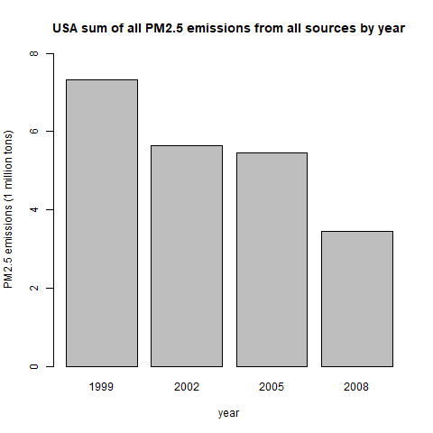
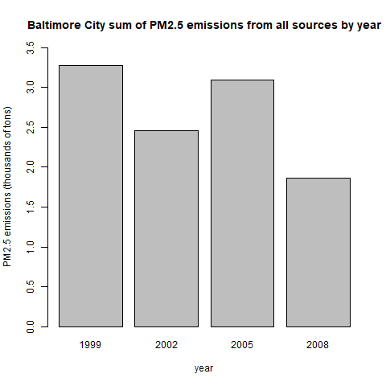
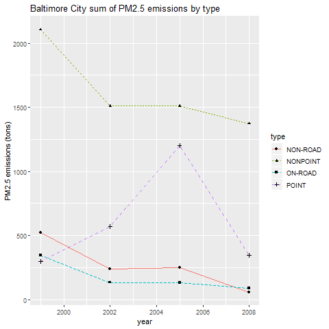
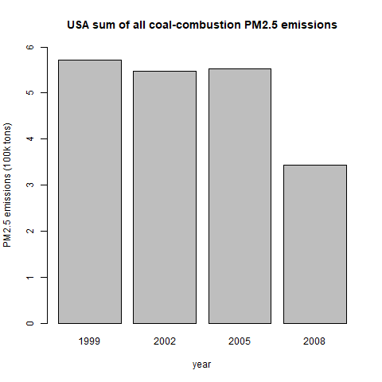
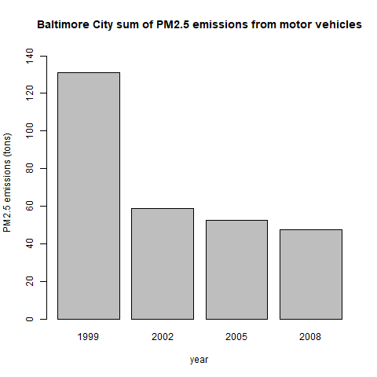
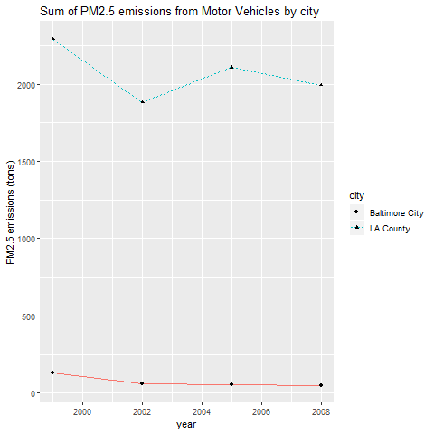

# Exploratory Data Analysis Week 4 Project

This project has us explore two data sets about particulate matter pollution. All code is prefixed with the following lines: 

```
# download & unzip data
url<- "https://d396qusza40orc.cloudfront.net/exdata%2Fdata%2FNEI_data.zip"
dest <- "data.zip"
download.file(url,dest,method="curl")
unzip("data.zip")

## This first line will likely take a few seconds. Be patient!
NEI <- readRDS("summarySCC_PM25.rds")
SCC <- readRDS("Source_Classification_Code.rds")

library(data.table) # data.table package, format NEI & SCC as data.tables
NEI<- as.data.table(NEI)
SCC<- as.data.table(SCC)

## Baltimore City fips = 24510
## LA County fips = 06037
```

## Question 1

Have total emissions from PM2.5 decreased in the United States from 1999 to 2008? Using the base plotting system, make a plot showing the total PM2.5 emission from all sources for each of the years 1999, 2002, 2005, and 2008. Upload a PNG file containing your plot addressing this question.

### plot1.R

```{r}
yearsum<- NEI[,.(YearSum=sum(Emissions)),by=.(year)]

# step 1 open png() device
dev.print(png, file = "Plot1.png", width = 480, height = 480)
png(file = "Plot1.png", bg = "transparent")
# step 2 plot the function
barplot(
(1/1000000)*(yearsum$YearSum), # Scale the sum by 1M
names = yearsum$year,
ylim=c(0,8),
xlab="year",
ylab="PM2.5 emissions (millions of tons)",
main="USA sum of all PM2.5 emissions from all sources by year"
) 
# step 3 close the png() device
dev.off()
```

### Plot 1 output



## Question 2

Have total emissions from PM2.5 decreased in the  Baltimore City, Maryland from 1999 to 2008? Use the base plotting system to make a plot answering this question.

Upload a PNG file containing your plot addressing this question.

### plot2.R
```
# interpreting //total// as "sum of all emissions"
fipstotal<- NEI[,.(fipsSum = sum(Emissions)),by=.(year,fips)]
bmore<- fipstotal[fips==24510]

# step 1 open png() device
dev.print(png, file = "Plot2.png", width = 480, height = 480)
png(file = "Plot2.png", bg = "transparent")
# step 2 plot the function
barplot(
(1/1000)*(bmore$fipsSum), # Scale the sum by 1k
names = bmore$year,
ylim=c(0,3.5),
xlab="year",
ylab="PM2.5 emissions (thousands of tons)",
main="Baltimore City sum of PM2.5 emissions from all sources by year"
) 
# step 3 close the png() device
dev.off()
```
### Plot 2 Output


## Question 3
Of the four types of sources indicated by the type (point, nonpoint, onroad, nonroad) variable, which of these four sources have seen decreases in emissions from 1999–2008 for Baltimore City? Which have seen increases in emissions from 1999–2008? Use the ggplot2 plotting system to make a plot answer this question.

Upload a PNG file containing your plot addressing this question.

### Plot3.R
```
library(data.table) # data.table package, format NEI & SCC as data.tables
library(ggplot2)

NEI<- as.data.table(NEI)
SCC<- as.data.table(SCC)

# Total is taken to mean the sum of all emissions
fipstotal<- NEI[,.(fipsSum = sum(Emissions)),by=.(year,type,fips)]
bmore<- fipstotal[fips==24510]

# step 1 open png() device
dev.print(png, file = "Plot3.png", width = 480, height = 480)
png(file = "Plot3.png", bg = "transparent")
# step 2 plot the function
g<- ggplot(data=bmore,aes(x=year,y=fipsSum,group=type))
g + geom_line(aes(color=type, linetype=type)) +
geom_point(aes(shape=type)) +
labs(y="PM2.5 emissions (tons)",title="Baltimore City sum of PM2.5 emissions by type")
# step 3 close the png() device
dev.off()
```

### Plot 3 Output


## Question 4
Across the United States, how have emissions from coal combustion-related sources changed from 1999–2008?

Upload a PNG file containing your plot addressing this question.

### Plot 4.R
```
library(data.table) # data.table package, format NEI & SCC as data.tables
library(dplyr)
NEI<- as.data.table(NEI)
SCC<- as.data.table(SCC)

# sum of all coal combustion sources
coal <- filter(SCC, grepl("Coal",EI.Sector)) # use dplyr to filter only coal combustion from SCC
coal$SCC <- as.character(coal$SCC) #change from factor to character
coalstring <- coal$SCC #create vector of just coal codes
NEIfiltered<- NEI[NEI$SCC %in% coalstring] # filter NEI to only coal-related items
yeartotal <- NEIfiltered[,.(YearSum=sum(Emissions)),by=.(year)]

# step 1 open png() device
dev.print(png, file = "Plot4.png", width = 480, height = 480)
png(file = "Plot4.png", bg = "transparent")
# step 2 plot the function
barplot(
(1/100000)*(yeartotal$YearSum), # Scale the sum by 100k
names = yeartotal$year,
ylim=c(0,6),
xlab="year",
ylab="PM2.5 emissions (100k tons)",
main="USA sum of all coal-combustion PM2.5 emissions"
)
# step 3 close the png() device
dev.off()
```

### Plot 4 output


## Question 5
How have emissions from motor vehicle sources changed from 1999–2008 in Baltimore City?

Upload a PNG file containing your plot addressing this question.

### Plot 5.R
```
library(data.table) # data.table package, format NEI & SCC as data.tables
library(dplyr)
NEI<- as.data.table(NEI)
SCC<- as.data.table(SCC)

# sum of all motor vehicle sources
roadgas <- filter(SCC, grepl("On-Road Gasoline",EI.Sector)) # dplyr needed for this
roadgas$SCC <- as.character(roadgas$SCC) #change from factor to character
roadgasstring <- roadgas$SCC #create vector of just road gasoline codes
NEIfiltered2<- NEI[NEI$SCC %in% roadgasstring] # filter NEI to only road gasonline-related items
NEIfiltered2<- NEIfiltered2[NEIfiltered2$Emissions>=0 & NEIfiltered2$fips==24510,] # filter NEI to emissions>0 and Bmore only
yeartotal2<- NEIfiltered2[,.(YearSum2=sum(Emissions)),by=.(year)] # sum of emissions by year

# step 1 open png() device
dev.print(png, file = "Plot5.png", width = 480, height = 480)
png(file = "Plot5.png", bg = "transparent")
# step 2 plot the function
barplot(
(1)*(yeartotal2$YearSum2),
names = yeartotal2$year,
ylim=c(0,145),
xlab="year",
ylab="PM2.5 emissions (tons)",
main="Baltimore City sum of PM2.5 emissions from motor vehicles"
) 
# step 3 close the png() device
dev.off()
```

### Plot 5 output


## Question 6
Compare emissions from motor vehicle sources in Baltimore City with emissions from motor vehicle sources in Los Angeles County, California. Which city has seen greater changes over time in motor vehicle emissions?

Upload a PNG file containing your plot addressing this question.

### Plot 6.R
```
library(data.table) # data.table package, format NEI & SCC as data.tables
library(dplyr)
library(ggplot2)
NEI<- as.data.table(NEI)
SCC<- as.data.table(SCC)

# sum of all motor vehicle sources in each city
roadgas <- filter(SCC, grepl("On-Road Gasoline",EI.Sector)) # dplyr needed for this
roadgas$SCC <- as.character(roadgas$SCC) #change from factor to character
roadgasstring <- roadgas$SCC #create vector of just road gasoline codes
NEIfiltered3<- NEI[NEI$SCC %in% roadgasstring] # filter NEI to only road gasonline-related items
NEIfiltered3<- NEIfiltered3[fips %in% c("24510","06037")] # filter NEI to LA County and Bmore only
yeartotal3<- NEIfiltered3[,.(YearSum3=sum(Emissions)),by=.(year,fips)] # sum of emissions by year and fips
names(yeartotal3)<- c("year","city","YearSum3")
yeartotal3$city <- gsub("24510","Baltimore City", yeartotal3$city)
yeartotal3$city <- gsub("06037","LA County", yeartotal3$city)

# step 1 open png() device
dev.print(png, file = "Plot6.png", width = 480, height = 480)
png(file = "Plot6.png", bg = "transparent")
# step 2 plot the function
g<- ggplot(data=yeartotal3,aes(x=year,y=YearSum3,group=city))
g + geom_line(aes(color=city, linetype=city)) +
geom_point(aes(shape=city)) +
labs(y="PM2.5 emissions (tons)",title="Sum of PM2.5 emissions from Motor Vehicles by city") 
# step 3 close the png() device
dev.off()
```

### Plot 6 output

